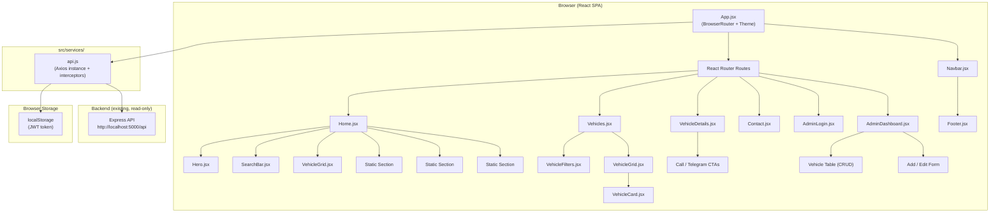
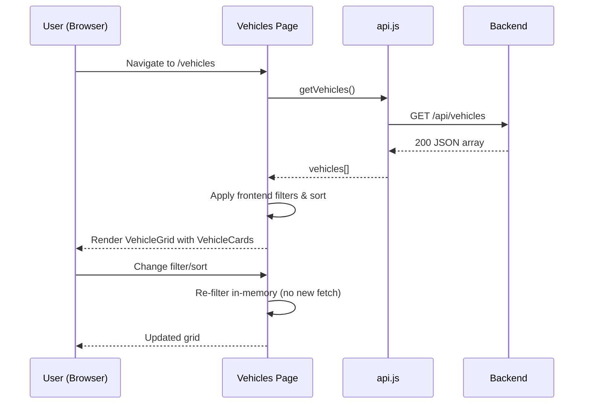
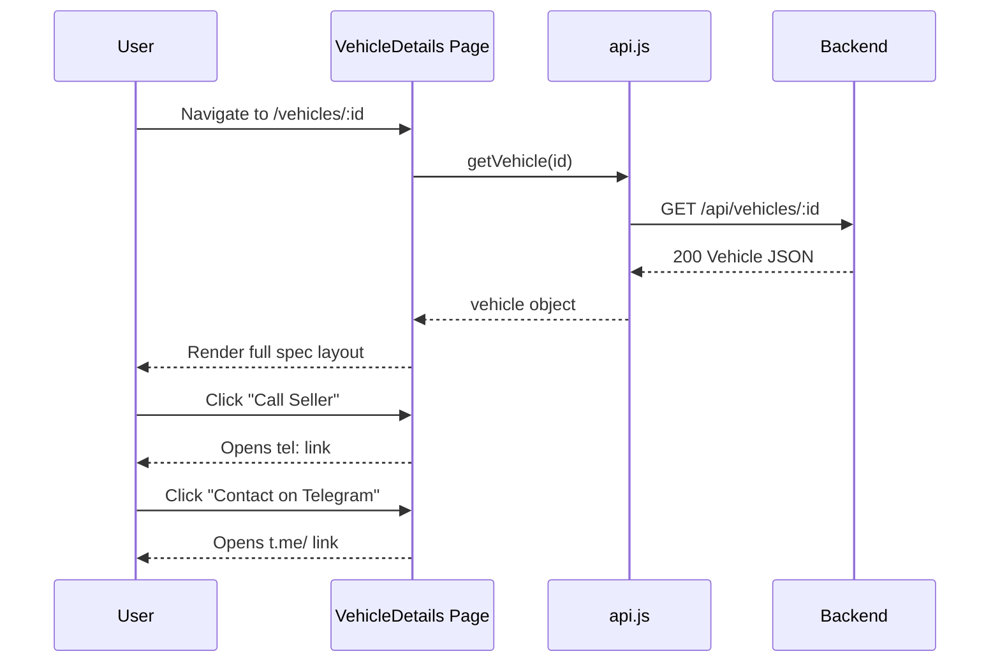
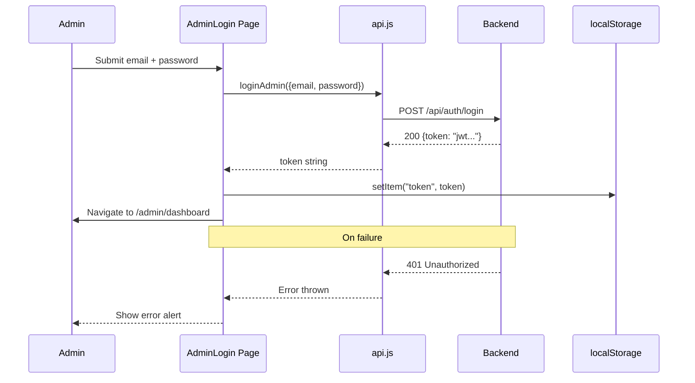
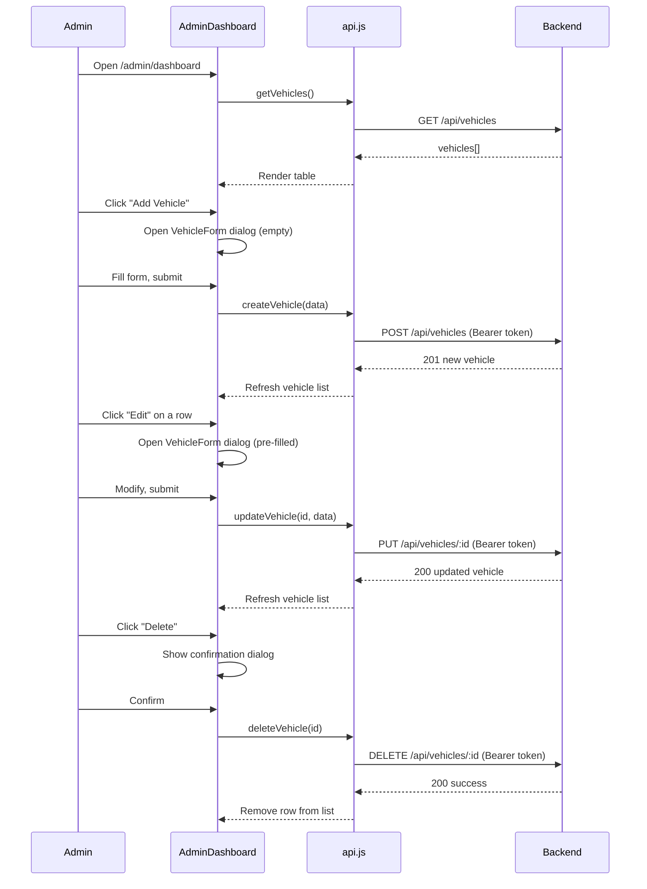

# Design Document: Sheger Motors Frontend

## Overview

Sheger Motors is a professional car-dealership website for a small car seller based in Addis Ababa, Ethiopia. The frontend is a React + Vite single-page application (SPA) that lets visitors browse available vehicles fetched from an existing Express/PostgreSQL backend, and allows an authenticated admin to manage the vehicle catalogue via a protected dashboard. There is no e-commerce flow — customers browse online, then contact the seller by phone or Telegram to arrange an in-person inspection and purchase.

The application is built entirely inside the `client/` folder and consumes the existing REST API at `http://localhost:5000/api`. All pages are rendered client-side using React Router v7. Material UI (MUI v6) is used for the component library, with a custom dark-navy/white/amber colour theme.

The existing codebase contains bare stub files for all pages and a minimal Navbar — every file will be fully implemented from scratch while preserving the existing file names, route structure, and `vite.config.js` / `package.json` configuration.

---

## Architecture



---

## Sequence Diagrams

### 1. Public User — Browse Vehicles



### 2. Public User — View Vehicle Details



### 3. Admin — Login Flow



### 4. Admin — CRUD Vehicle



---

## Components and Interfaces

### App.jsx

**Purpose**: Root component. Provides MUI theme, BrowserRouter, and route tree. Also renders Navbar (top) and Footer (bottom) outside the `<Routes>` so they appear on every page.

**Responsibilities**:
- Define and inject MUI `createTheme` with Sheger Motors colour palette
- Wrap everything in `<ThemeProvider>` and `<CssBaseline>`
- Declare all routes using React Router v7 `<Routes>` / `<Route>`
- Render `<Navbar>` above and `<Footer>` below the route outlet

---

### Navbar.jsx

**Purpose**: Top navigation bar, responsive with hamburger menu on mobile.

**Interface**:
```jsx
// No props — reads location via useLocation() internally
<Navbar />
```

**Responsibilities**:
- Display "Sheger Motors" text logo (left)
- Desktop nav links: Home, Vehicles, Contact
- "Browse Cars" CTA button (right, accent colour)
- Mobile: collapse nav links into a `<Drawer>` triggered by a hamburger `<IconButton>`
- Highlight active route link using `useLocation()`
- Sticky (position: fixed) with backdrop blur

---

### Footer.jsx

**Purpose**: Site-wide footer with brand, links, and contact info.

**Interface**:
```jsx
// No props
<Footer />
```

**Responsibilities**:
- Brand name + tagline
- Navigation links (Home, Vehicles, Contact)
- Contact block: phone placeholder, Telegram placeholder, location
- Copyright line: © 2026 Sheger Motors

---

### Hero.jsx

**Purpose**: Full-viewport hero section on the Home page.

**Interface**:
```jsx
// No props — uses static content and React Router's useNavigate
<Hero />
```

**Responsibilities**:
- Dark overlay background using `client/src/assets/hero.png`
- Headline, sub-headline, two CTA buttons ("Browse Vehicles" → `/vehicles`, "Contact Us" → `/contact`)
- Trust tagline: "Quality Vehicles • Trusted Service • Addis Ababa"

---

### VehicleCard.jsx

**Purpose**: Reusable card representing a single vehicle in grid/list views.

**Interface**:
```jsx
<VehicleCard vehicle={vehicle} />
```

| Prop | Type | Description |
|------|------|-------------|
| `vehicle` | `object` | Full vehicle object from API |

**Responsibilities**:
- Image placeholder area (grey background with car icon) — Supabase images later
- Brand + model name (card title)
- Year, mileage, fuel type, transmission chips/badges
- Price formatted as `"2,600,000 ETB"`
- Condition badge (New / Used)
- "View Details" button → navigates to `/vehicles/:id`

---

### VehicleGrid.jsx

**Purpose**: Responsive grid wrapper that renders a list of `VehicleCard` components.

**Interface**:
```jsx
<VehicleGrid vehicles={vehicles} loading={loading} />
```

| Prop | Type | Description |
|------|------|-------------|
| `vehicles` | `array` | Array of vehicle objects |
| `loading` | `boolean` | Shows skeleton loaders when true |

**Responsibilities**:
- Render MUI `<Grid>` with responsive column counts (xs=1, sm=2, md=3, lg=4)
- Show `<Loading>` skeletons when `loading === true`
- Show `<EmptyState>` when `vehicles.length === 0 && !loading`

---

### SearchBar.jsx

**Purpose**: Quick-search bar used on the Home page. Navigates to `/vehicles` with query params.

**Interface**:
```jsx
<SearchBar />
```

**Responsibilities**:
- Inputs: brand/model text field, condition select (All/New/Used), min price, max price
- "Search Cars" button → calls `useNavigate("/vehicles?q=...")` with serialised params
- Vehicles page reads these params on mount to pre-populate its filter state

---

### VehicleFilters.jsx

**Purpose**: Full filter panel on the Vehicles page (sidebar or collapsible drawer on mobile).

**Interface**:
```jsx
<VehicleFilters filters={filters} onChange={handleFilterChange} onReset={handleReset} />
```

| Prop | Type | Description |
|------|------|-------------|
| `filters` | `object` | Current filter state |
| `onChange` | `(key, value) => void` | Update a single filter field |
| `onReset` | `() => void` | Reset all filters to defaults |

**Filter fields**: search (text), brand (text), condition (select), fuel_type (select), transmission (select), body_type (select), year_min (number), year_max (number), price_min (number), price_max (number)

---

### Loading.jsx

**Purpose**: Loading skeleton component for vehicle cards.

**Interface**:
```jsx
<Loading count={6} />
```

| Prop | Type | Default | Description |
|------|------|---------|-------------|
| `count` | `number` | `6` | Number of skeleton cards to render |

---

### EmptyState.jsx

**Purpose**: Friendly empty-state message when no vehicles match filters.

**Interface**:
```jsx
<EmptyState message="No vehicles found." actionLabel="Clear Filters" onAction={handleReset} />
```

| Prop | Type | Description |
|------|------|-------------|
| `message` | `string` | Primary message text |
| `actionLabel` | `string` | Optional CTA button label |
| `onAction` | `() => void` | Optional CTA button handler |

---

## Data Models

### Vehicle Object (from API)

```javascript
// As returned by GET /api/vehicles and GET /api/vehicles/:id
const vehicle = {
  id: 3,                          // number
  brand: "Toyota",                 // string
  model: "Corolla",                // string
  year: 2023,                      // number
  price: "2600000.00",             // string (decimal from DB)
  mileage: 35000,                  // number (km)
  fuel_type: "Petrol",             // "Petrol" | "Diesel" | "Hybrid" | "Electric"
  transmission: "Automatic",       // "Automatic" | "Manual"
  engine: "1.8L",                  // string
  color: "Black",                  // string
  body_type: "Sedan",              // "Sedan" | "SUV" | "Hatchback" | "Pickup" | ...
  condition: "Used",               // "New" | "Used"
  description: "...",              // string
  location: "Addis Ababa",         // string
  status: "AVAILABLE",             // "AVAILABLE" | "SOLD"
}
```

### Filter State Object (frontend-only)

```javascript
const defaultFilters = {
  search: "",         // free text — matches brand + model
  brand: "",          // exact brand name
  condition: "All",   // "All" | "New" | "Used"
  fuel_type: "All",   // "All" | "Petrol" | "Diesel" | "Hybrid" | "Electric"
  transmission: "All",// "All" | "Automatic" | "Manual"
  body_type: "All",   // "All" | "Sedan" | "SUV" | ...
  year_min: "",       // number string or ""
  year_max: "",       // number string or ""
  price_min: "",      // number string or ""
  price_max: "",      // number string or ""
  sort: "newest",     // "newest" | "price_asc" | "price_desc" | "year_desc"
}
```

### Auth State (localStorage)

```javascript
// Stored under key "token"
localStorage.setItem("token", "eyJhbGci...")

// Read back
const token = localStorage.getItem("token")

// Removed on logout
localStorage.removeItem("token")
```

### Vehicle Form State (AdminDashboard)

```javascript
const emptyForm = {
  brand: "",
  model: "",
  year: "",
  price: "",
  mileage: "",
  fuel_type: "Petrol",
  transmission: "Automatic",
  engine: "",
  color: "",
  body_type: "Sedan",
  condition: "Used",
  description: "",
  location: "Addis Ababa",
  status: "AVAILABLE",
}
```

---

## Algorithmic Pseudocode

### Frontend Vehicle Filtering Algorithm

```pascal
FUNCTION filterAndSortVehicles(vehicles, filters)
  INPUT:  vehicles: Vehicle[]   -- raw list from API
          filters:  FilterState -- current filter values
  OUTPUT: result: Vehicle[]     -- filtered and sorted list

BEGIN
  result ← vehicles

  // 1. Text search: brand OR model contains query (case-insensitive)
  IF filters.search ≠ "" THEN
    query ← toLowerCase(filters.search)
    result ← FILTER result WHERE
      toLowerCase(v.brand) CONTAINS query
      OR toLowerCase(v.model) CONTAINS query
  END IF

  // 2. Exact brand match
  IF filters.brand ≠ "" THEN
    result ← FILTER result WHERE toLowerCase(v.brand) = toLowerCase(filters.brand)
  END IF

  // 3. Condition
  IF filters.condition ≠ "All" THEN
    result ← FILTER result WHERE v.condition = filters.condition
  END IF

  // 4. Fuel type
  IF filters.fuel_type ≠ "All" THEN
    result ← FILTER result WHERE v.fuel_type = filters.fuel_type
  END IF

  // 5. Transmission
  IF filters.transmission ≠ "All" THEN
    result ← FILTER result WHERE v.transmission = filters.transmission
  END IF

  // 6. Body type
  IF filters.body_type ≠ "All" THEN
    result ← FILTER result WHERE v.body_type = filters.body_type
  END IF

  // 7. Year range
  IF filters.year_min ≠ "" THEN
    result ← FILTER result WHERE v.year >= toNumber(filters.year_min)
  END IF
  IF filters.year_max ≠ "" THEN
    result ← FILTER result WHERE v.year <= toNumber(filters.year_max)
  END IF

  // 8. Price range (convert string price to number)
  IF filters.price_min ≠ "" THEN
    result ← FILTER result WHERE toNumber(v.price) >= toNumber(filters.price_min)
  END IF
  IF filters.price_max ≠ "" THEN
    result ← FILTER result WHERE toNumber(v.price) <= toNumber(filters.price_max)
  END IF

  // 9. Sort
  CASE filters.sort OF
    "newest"     : SORT result BY v.id DESCENDING
    "price_asc"  : SORT result BY toNumber(v.price) ASCENDING
    "price_desc" : SORT result BY toNumber(v.price) DESCENDING
    "year_desc"  : SORT result BY v.year DESCENDING
  END CASE

  RETURN result
END FUNCTION
```

**Preconditions**:
- `vehicles` is a valid array (may be empty)
- `filters` contains all required keys with valid default values

**Postconditions**:
- Returns a new array — original `vehicles` array is not mutated
- Result length is ≤ `vehicles.length`
- If all filters are at default values, result equals `vehicles` sorted by newest

**Loop Invariants**:
- Each filter step only removes vehicles; it never adds vehicles not in the previous step's result

---

### Price Formatting Algorithm

```pascal
FUNCTION formatPrice(price)
  INPUT:  price: string | number   -- e.g. "2600000.00" or 2600000
  OUTPUT: formatted: string        -- e.g. "2,600,000 ETB"

BEGIN
  n ← toNumber(price)
  IF isNaN(n) THEN RETURN "Price N/A" END IF
  RETURN n.toLocaleString("en-ET") + " ETB"
END FUNCTION
```

---

### Authentication Guard Algorithm

```pascal
FUNCTION ProtectedRoute(children)
  INPUT:  children: ReactNode
  OUTPUT: ReactNode (children or redirect)

BEGIN
  token ← localStorage.getItem("token")
  IF token IS NULL OR token = "" THEN
    RETURN <Navigate to="/admin/login" replace />
  END IF
  RETURN children
END FUNCTION
```

**Preconditions**: Component is rendered inside a `<BrowserRouter>`

**Postconditions**:
- If no token exists, user is redirected to `/admin/login`
- If token exists, children are rendered (token validity is verified by backend on API calls)

---

### Admin Login Flow Algorithm

```pascal
PROCEDURE handleLoginSubmit(email, password, navigate)
  INPUT: email: string, password: string, navigate: NavigateFunction

BEGIN
  SET loading ← true
  SET error ← ""

  TRY
    response ← AWAIT loginAdmin({email, password})
    token ← response.data.token
    localStorage.setItem("token", token)
    navigate("/admin/dashboard")
  CATCH err
    IF err.response.status = 401 THEN
      SET error ← "Invalid email or password."
    ELSE
      SET error ← "An error occurred. Please try again."
    END IF
  FINALLY
    SET loading ← false
  END TRY
END PROCEDURE
```

---

### Admin Vehicle CRUD Procedure

```pascal
PROCEDURE handleVehicleFormSubmit(formData, editingId, vehicleList, setVehicleList)
  INPUT:
    formData:     object      -- form field values
    editingId:    number|null -- null = create, number = update
    vehicleList:  Vehicle[]
    setVehicleList: (Vehicle[]) => void

BEGIN
  TRY
    IF editingId IS NULL THEN
      response ← AWAIT createVehicle(formData)
      SET vehicleList ← [...vehicleList, response.data]
    ELSE
      response ← AWAIT updateVehicle(editingId, formData)
      SET vehicleList ← vehicleList MAP (v → IF v.id = editingId THEN response.data ELSE v)
    END IF
    CLOSE form dialog
    SHOW success snackbar
  CATCH err
    SHOW error snackbar with err.message
  END TRY
END PROCEDURE

PROCEDURE handleDeleteVehicle(id, vehicleList, setVehicleList)
  INPUT: id: number, vehicleList: Vehicle[], setVehicleList

BEGIN
  AWAIT confirmation dialog
  IF confirmed THEN
    TRY
      AWAIT deleteVehicle(id)
      SET vehicleList ← FILTER vehicleList WHERE v.id ≠ id
      SHOW success snackbar
    CATCH err
      SHOW error snackbar
    END TRY
  END IF
END PROCEDURE
```

---

## Key Functions with Formal Specifications

### `getVehicles()` — api.js

```javascript
async function getVehicles()
// Returns: Promise<AxiosResponse<Vehicle[]>>
```

**Preconditions**:
- Backend is reachable at `http://localhost:5000/api`

**Postconditions**:
- Resolves with an array of vehicle objects
- On network error, throws an AxiosError

---

### `getVehicle(id)` — api.js

```javascript
async function getVehicle(id)
// id: number | string
// Returns: Promise<AxiosResponse<Vehicle>>
```

**Preconditions**:
- `id` is a valid positive integer
- Vehicle with that id exists on the backend

**Postconditions**:
- Resolves with a single vehicle object
- On 404, throws AxiosError with status 404

---

### `loginAdmin(credentials)` — api.js

```javascript
async function loginAdmin({ email, password })
// Returns: Promise<AxiosResponse<{ token: string }>>
```

**Preconditions**:
- `email` is a non-empty string
- `password` is a non-empty string

**Postconditions**:
- On success: resolves with `{ token: string }`
- On invalid credentials: throws AxiosError with status 401
- Does NOT store token (caller's responsibility)

---

### `createVehicle(data)` / `updateVehicle(id, data)` — api.js

```javascript
async function createVehicle(data)   // POST /api/vehicles
async function updateVehicle(id, data) // PUT /api/vehicles/:id
```

**Preconditions**:
- Valid JWT is stored in `localStorage` (interceptor adds it automatically)
- `data` contains all required vehicle fields

**Postconditions**:
- `createVehicle`: resolves with the newly created vehicle object (status 201)
- `updateVehicle`: resolves with the updated vehicle object (status 200)
- On 401, throws AxiosError (token expired or missing)

---

### `deleteVehicle(id)` — api.js

```javascript
async function deleteVehicle(id)
// Returns: Promise<AxiosResponse<void>>
```

**Preconditions**:
- Valid JWT in localStorage
- Vehicle with `id` exists

**Postconditions**:
- Vehicle is removed from the database
- Returns 200 on success

---

## Example Usage

### Using api.js in a component

```javascript
import { getVehicles, getVehicle, loginAdmin, createVehicle, updateVehicle, deleteVehicle } from "../services/api"

// Fetch all vehicles
useEffect(() => {
  setLoading(true)
  getVehicles()
    .then(res => setVehicles(res.data))
    .catch(() => setError("Could not load vehicles. Please try again."))
    .finally(() => setLoading(false))
}, [])

// Fetch single vehicle
useEffect(() => {
  getVehicle(id)
    .then(res => setVehicle(res.data))
    .catch(err => {
      if (err.response?.status === 404) setNotFound(true)
      else setError("Failed to load vehicle details.")
    })
}, [id])

// Admin login
const handleLogin = async (e) => {
  e.preventDefault()
  try {
    const res = await loginAdmin({ email, password })
    localStorage.setItem("token", res.data.token)
    navigate("/admin/dashboard")
  } catch {
    setError("Invalid credentials.")
  }
}
```

### Using VehicleCard

```jsx
// In VehicleGrid.jsx
{vehicles.map(vehicle => (
  <Grid item xs={12} sm={6} md={4} lg={3} key={vehicle.id}>
    <VehicleCard vehicle={vehicle} />
  </Grid>
))}
```

### Using VehicleFilters

```jsx
// In Vehicles.jsx
<VehicleFilters
  filters={filters}
  onChange={(key, value) => setFilters(prev => ({ ...prev, [key]: value }))}
  onReset={() => setFilters(defaultFilters)}
/>
```

### Price formatting

```javascript
// Utility function in src/utils/format.js (or inline)
export function formatPrice(price) {
  const n = parseFloat(price)
  if (isNaN(n)) return "Price N/A"
  return n.toLocaleString("en-ET") + " ETB"
}
// → "2,600,000 ETB"
```

---

## Correctness Properties

*A property is a characteristic or behavior that should hold true across all valid executions of a system — essentially, a formal statement about what the system should do. Properties serve as the bridge between human-readable specifications and machine-verifiable correctness guarantees.*

### Property 1: Filter Idempotency

*For any* vehicles array and any filter state object, applying `filterAndSortVehicles` twice with the same filter state always produces the same result set as applying it once.

**Validates: Requirements 3.6**

### Property 2: Filter Monotonicity

*For any* vehicles array and any filter state where at least one field holds a non-default (active) value, the length of the filtered result is less than or equal to the length of the unfiltered list.

**Validates: Requirements 3.9**

### Property 3: Filter Correctness

*For any* vehicles array and any active filter state, every vehicle in the result set satisfies all active filter conditions simultaneously, and no vehicle that fails any active filter condition appears in the result.

**Validates: Requirements 3.8**

### Property 4: Default Filter Returns Full List

*For any* vehicles array, applying `filterAndSortVehicles` with the default filter state (all fields at their default values) returns all vehicles sorted by descending id.

**Validates: Requirements 3.7**

### Property 5: Filter Reset Restores Full List

*For any* VehicleFilters state, calling `onReset` restores every filter field to its default value, which causes `filterAndSortVehicles` to return the full unfiltered vehicle list.

**Validates: Requirements 3.10**

### Property 6: Price Format Completeness

*For any* input value passed to `formatPrice` (valid numeric string, numeric value, NaN, null, or undefined), the function always returns a non-empty string.

**Validates: Requirements 10.4**

### Property 7: Valid Price Ends With " ETB"

*For any* price value that parses to a finite number, `formatPrice` returns a string that ends with `" ETB"`.

**Validates: Requirements 10.1**

### Property 8: Auth Guard Completeness

*For any* children component, `ProtectedRoute` never renders those children when `localStorage.getItem("token")` returns `null` or an empty string.

**Validates: Requirements 7.3**

### Property 9: Create Vehicle Appears Exactly Once

*For any* vehicle list and any successful `createVehicle` response, the new vehicle's `id` appears in the updated list exactly once.

**Validates: Requirements 8.5**

### Property 10: Delete Vehicle Removes All Occurrences

*For any* vehicle list and any successful `deleteVehicle(id)` call, the resulting local state contains no vehicle object whose `id` equals the deleted id.

**Validates: Requirements 8.10**

### Property 11: API Service Always Attaches Token When Present

*For any* outgoing API request made while a non-empty token exists in `localStorage`, the request includes an `Authorization: Bearer <token>` header.

**Validates: Requirements 9.2**

---

## Error Handling

### Network / Backend Unavailable

**Condition**: Axios request fails with network error (backend not running)
**Response**: Show a MUI `<Alert severity="error">` with message "Could not connect to the server. Please try again later."
**Recovery**: User can retry using a "Try Again" button that re-triggers the useEffect fetch

### Empty Vehicle List

**Condition**: API returns `[]` (no vehicles in database)
**Response**: Show `<EmptyState message="No vehicles are currently listed." />`
**Recovery**: Admin can add vehicles via the dashboard

### Vehicle Not Found (404)

**Condition**: GET `/api/vehicles/:id` returns 404
**Response**: Show full-page `<EmptyState message="Vehicle not found." actionLabel="Back to Vehicles" onAction={() => navigate('/vehicles')} />`

### Filters Produce No Results

**Condition**: Frontend filter reduces result set to empty
**Response**: Show `<EmptyState message="No vehicles match your filters." actionLabel="Clear Filters" onAction={handleReset} />`

### Login Failure (401)

**Condition**: POST `/api/auth/login` returns 401
**Response**: Show `<Alert severity="error">` inline: "Invalid email or password."
**Recovery**: User can correct credentials and try again

### Admin Action Failure (403/500)

**Condition**: Create/Update/Delete returns error
**Response**: Show MUI `<Snackbar>` with error message
**Recovery**: No data mutation applied; user can retry

### Missing `@mui/icons-material` Package

**Condition**: Package not listed in dependencies
**Response**: Add `@mui/icons-material` as a dependency before implementing icon usage
**Recovery**: Run `npm install @mui/icons-material` in `client/`

---

## Testing Strategy

### Unit Testing Approach

Test pure utility functions in isolation:
- `filterAndSortVehicles(vehicles, filters)` — test each filter field independently and in combination
- `formatPrice(price)` — test valid numbers, strings, NaN, null, zero
- `ProtectedRoute` — test redirect when token absent, render when token present

**Test library**: Vitest + React Testing Library (standard for Vite projects)

### Property-Based Testing Approach

**Property Test Library**: fast-check

Key properties to test:
- For any `vehicles` array and any valid `filters` object: `filterAndSortVehicles(vehicles, filters).length <= vehicles.length`
- For any vehicle in `filterAndSortVehicles(vehicles, defaultFilters)`: every vehicle from the original array appears in the result
- For any non-empty `price` string that parses to a finite number: `formatPrice(price)` ends with `" ETB"`

### Integration Testing Approach

- Mock Axios in component tests using `vi.mock("../services/api")`
- Test Vehicles page: renders loading state, then vehicle cards, then filters work correctly
- Test AdminDashboard: redirects to login if no token; shows vehicle table if token present

---

## Performance Considerations

- **Single fetch, client-side filter**: All filtering and sorting happens in memory after a single `GET /api/vehicles` call. This is appropriate for a small dealership with a catalogue of tens to low hundreds of vehicles. No pagination needed at this scale.
- **React.useMemo for filtered list**: The filtered/sorted vehicle list is memoized with `useMemo` to avoid recomputing on unrelated re-renders.
- **Lazy loading routes**: Optional — use `React.lazy` + `<Suspense>` for Admin pages to reduce initial bundle size, since those pages are rarely visited by public users.
- **Image placeholders**: Since Supabase image integration is deferred, image slots use a CSS background-color placeholder (no heavy image loading).

---

## Security Considerations

- **JWT stored in localStorage**: Acceptable for this use case (small internal admin, non-sensitive dealership data). The token is sent only over `localhost` during development. For production, consider `httpOnly` cookies.
- **Token sent via Axios interceptor**: The `Authorization: Bearer <token>` header is added automatically to every request. The interceptor reads from localStorage on each request, so token removal immediately stops authenticated calls.
- **No sensitive data displayed to public**: Vehicle details contain only car specs and contact placeholders — no customer data, no payment information.
- **Admin route guard**: `ProtectedRoute` provides client-side protection. The backend also validates the JWT on every protected endpoint, so a frontend bypass does not compromise data.
- **Contact placeholders**: Phone and Telegram values are hardcoded placeholders (`PHONE_NUMBER_HERE`, `TELEGRAM_USERNAME_HERE`) — no real contact data is embedded in the source.

---

## Dependencies

| Package | Version (installed) | Purpose |
|---|---|---|
| `react` | `^18.3.1` | UI framework |
| `react-dom` | `^18.3.1` | DOM renderer |
| `react-router-dom` | `^7.18.2` | Client-side routing |
| `axios` | `^1.19.0` | HTTP client |
| `@mui/material` | `^6.4.0` | Component library |
| `@emotion/react` | `^11.14.0` | MUI dependency |
| `@emotion/styled` | `^11.14.0` | MUI dependency |
| `@mui/icons-material` | to install | MUI icon set |
| `vite` | `^8.2.0` | Build tool |
| `@vitejs/plugin-react` | `^6.0.5` | Vite React plugin |

**Action required before implementation**: Install `@mui/icons-material`:
```bash
cd client && npm install @mui/icons-material
```

---

## MUI Theme Specification

```javascript
// Colour palette for Sheger Motors
const theme = createTheme({
  palette: {
    mode: "light",
    primary: {
      main: "#0A1929",      // deep navy — header, footer, primary buttons
      light: "#1E3A5F",
      dark: "#050E18",
    },
    secondary: {
      main: "#F59E0B",      // amber accent — CTA buttons, badges, highlights
      light: "#FCD34D",
      dark: "#D97706",
    },
    background: {
      default: "#F8F9FA",   // off-white page background
      paper: "#FFFFFF",     // card surfaces
    },
    text: {
      primary: "#1A1A1A",
      secondary: "#6B7280",
    },
  },
  typography: {
    fontFamily: '"Inter", "Roboto", "Helvetica", "Arial", sans-serif',
    h1: { fontWeight: 800 },
    h2: { fontWeight: 700 },
    h3: { fontWeight: 700 },
    h4: { fontWeight: 600 },
  },
  shape: {
    borderRadius: 12,       // rounded cards throughout
  },
  components: {
    MuiButton: {
      styleOverrides: {
        root: { textTransform: "none", fontWeight: 600, borderRadius: 8 }
      }
    },
    MuiCard: {
      styleOverrides: {
        root: { boxShadow: "0 2px 12px rgba(0,0,0,0.08)", borderRadius: 12 }
      }
    }
  }
})
```
